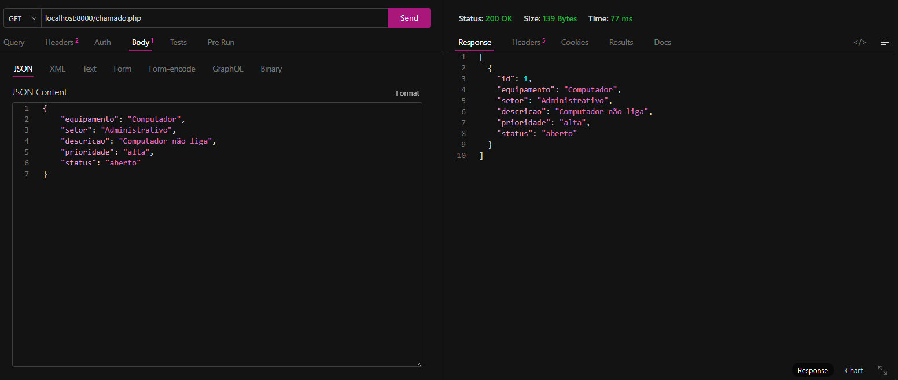
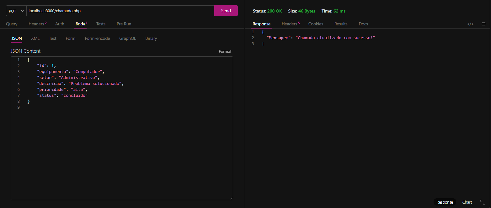
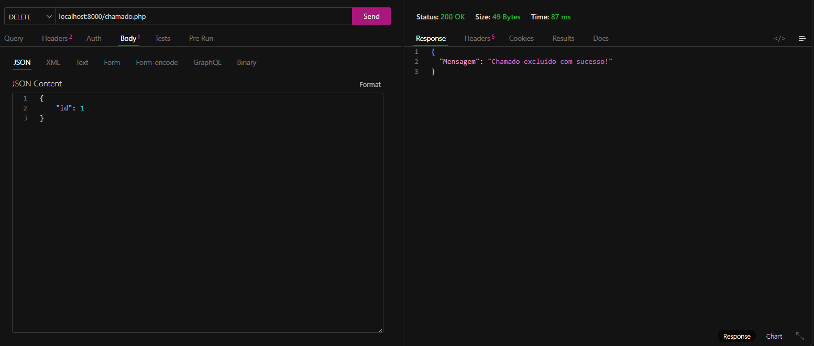

# Atividade 09 - Desenvolvimento de API REST com Operações CRUD e SQL

## Projeto – Sistema de Gerenciamento de Chamados de Manutenção

Este projeto consiste no desenvolvimento de uma API REST utilizando PHP, com a finalidade de administrar chamados relacionados à manutenção de uma empresa.

Por meio da API, é possível inserir novos chamados, visualizar os registros existentes, modificar informações e remover chamados. Para isso, são utilizados os métodos HTTP **GET, POST, PUT e DELETE.**

As informações são armazenadas em um banco de dados SQL e a comunicação entre a aplicação e o cliente é realizada através do formato JSON.

- Objetivo

O principal objetivo desta atividade é desenvolver uma API capaz de organizar e controlar chamados de manutenção, permitindo registrar problemas e acompanhar suas respectivas situações.

Para isso, foram implementadas as principais operações de um sistema CRUD:

> POST – Inserir um novo chamado

> GET – Consultar os chamados cadastrados

> PUT – Alterar os dados de um chamado

> DELETE – Remover um chamado

**Tecnologias utilizadas:**

- PHP

- PostgreSQL

- SQL

- PDO

- JSON

- HTTP

- API REST

**Estrutura do banco de dados**

Para guardar os registros dos chamados, foi criada uma tabela específica no banco de dados.

Tabela: chamados
Campo	Finalidade
id	Código de identificação do chamado
equipamento	Equipamento que apresenta o problema
setor	Local ou setor relacionado ao chamado
descricao	Informações sobre o problema encontrado
prioridade	Nível de urgência do chamado
status	Estado atual do atendimento

O campo id funciona como chave primária da tabela e é gerado automaticamente pelo banco de dados.

- Prioridade:

> baixa

> media

> alta

- Status:

> aberto

> em andamento

> concluido

### Testes das requisições HTTP

1. POST – Inserção de chamado

O POST é responsável por adicionar um novo chamado ao sistema.

Dados enviados
```json
{
    "equipamento": "Computador",
    "setor": "Administrativo",
    "descricao": "Computador não liga",
    "prioridade": "alta",
    "status": "aberto"
}
```

Registro da execução:
i

Retorno:
```json
{
    "Mensagem": "Novo chamado cadastrado com sucesso!"
}
```

2. GET – Consulta dos chamados

O método GET permite recuperar os chamados que estão registrados no banco de dados.


Registro da execução:


Exemplo de retorno:
```json
[
    {
        "id": 3,
        "equipamento": "Computador",
        "setor": "Administrativo",
        "descricao": "Computador não liga",
        "prioridade": "alta",
        "status": "aberto"
    }
]
```

3. PUT – Alteração de chamado

O método PUT é utilizado quando é necessário modificar os dados de um chamado que já está cadastrado. O registro é localizado utilizando seu id.


Dados enviados:
```json
{
    "id": 1,
    "equipamento": "Computador",
    "setor": "Administrativo",
    "descricao": "Problema solucionado",
    "prioridade": "alta",
    "status": "concluido"
}
```
Registro da execução:


Retorno:
```json
{
    "Mensagem": "Chamado atualizado com sucesso!"
}
```

4. DELETE – Remoção de chamado

O DELETE é utilizado para retirar um chamado do banco de dados. Para identificar qual registro será removido, é informado o seu id.

Dados enviados:
```json
{
    "id": 1
}
```
Registro da execução:


Retorno:
```json
{
    "Mensagem": "Chamado excluído com sucesso!"
}
```
---

O sistema foi desenvolvido seguindo o conceito de CRUD, que representa as quatro operações fundamentais para manipulação de dados:

`Create → Read → Update → Delete`

> Create: responsável pela criação de novos registros utilizando o método POST.

> Read: permite visualizar os registros existentes por meio do método GET.

> Update: possibilita modificar informações já cadastradas utilizando o PUT.

> Delete: realiza a remoção de registros através do método DELETE.


A aplicação utiliza PDO para comunicação com o banco e JSON para o envio e recebimento das informações. Também foram implementadas as operações GET, POST, PUT e DELETE, tornando possível cadastrar, consultar, alterar e excluir chamados de manutenção de maneira organizada.